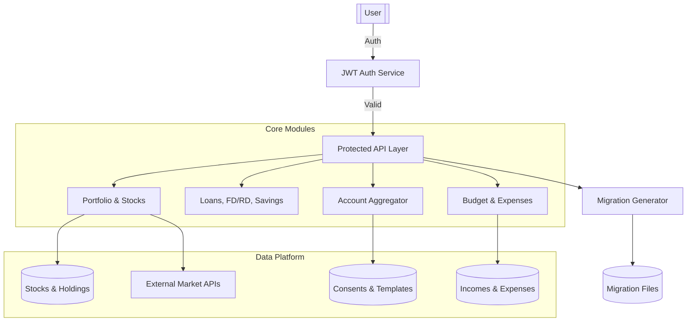

# 💰 PI SYSTEM — Personal Finance & Investment Intelligence

PI SYSTEM is a comprehensive Spring Boot-based financial intelligence platform designed to centralize and analyze your entire financial life. From tracking stock portfolios to managing loans and automating account aggregation, it provides a unified view for data-driven financial decisions.

> 📖 **Documentation**: Start with [docs/DOCUMENTATION_INDEX.md](docs/DOCUMENTATION_INDEX.md) for complete navigation  
> 📊 **Product**: See [PRODUCT.md](./PRODUCT.md) for Implemented vs. Planned features  
> 📈 **Progress**: Check [docs/PROGRESS.md](docs/PROGRESS.md) for current development status

---

## 🌟 Key Capabilities

- **📊 Portfolio Management**: Track stocks, ETFs, and mutual funds with real-time price updates.
- **📈 Performance Analytics**: Automated XIRR calculation and sector-based diversification scoring.
- **💸 Wealth Tracking**: Integrated management of Savings Accounts, FD/RD, Loans, and Insurance.
- **💰 Loans Management**: Complete loan lifecycle management with amortization, payment tracking, prepayment simulation, foreclosure calculation, and comprehensive analytics.
- **🏦 Account Aggregator (AA)**: Mock AA implementation for simulating bank data consent and fetching financial information.
- **📅 Budgeting & Expenses**: Track monthly limits, categorize expenses, and monitor income streams.
- **🛡️ Security**: JWT-based authentication with BCrypt encryption and role-based access.
- **🛠️ Developer Tools**: Built-in API to generate Flyway migration scripts with auto-formatting and versioning.
- **🔍 Audit & Logging**: System-wide request auditing and error logging for robustness.

---

## 🧭 System Architecture



---

## 🖥️ Frontend (React + Vite)

Located in the `/frontend` directory, the UI is built for a premium, high-performance experience.

- **Tech Stack**: React 18, Vite, Vanilla CSS, Recharts, Lucide Icons.
- **Rich Aesthetics**: Dark mode, glassmorphism, and smooth transitions.
- **Modules**: Portfolio Dashboard, Budget Tracker, Loans Manager, AA Consent Manager, Net Worth Overview.

**Quick Start UI:**
```bash
cd frontend
npm install
npm run dev
```

---

## ⚙️ Backend (Spring Boot)

### Tech Stack
- **Source**: Java 17, Spring Boot 3
- **Database**: MySQL 8 (Flyway for migrations), Redis (Caching)
- **Security**: Spring Security + JWT
- **Documentation**: OpenAPI 3 / Swagger UI

### 🛠️ Developer Utility: Migration Generator
Created to reduce stress for developers, this API automatically creates Flyway migration files.
- **Endpoint**: `POST /api/v1/dev/migration/generate`
- **Features**: Auto-versioning, SQL keyword uppercasing, and `IF NOT EXISTS` safety checks.

### Running Locally
1. **Prerequisites**: Ensure MySQL and Redis are running.
2. **Configure**: Update `src/main/resources/application.yml`.
3. **Launch**:
   ```bash
   ./gradlew bootRun
   ```
4. **Docs**: Explore APIs at `http://localhost:8082/swagger-ui.html`

---

## 📁 Project Structure
- `src/main/java/com/aa`: Account Aggregator logic.
- `src/main/java/com/budget`: Budgeting and expense tracking (52% complete - see [docs/BUDGET_MODULE.md](docs/BUDGET_MODULE.md)).
- `src/main/java/com/portfolio`: Core investment and stock logic.
- `src/main/java/com/common/devtools`: Developer productivity tools.
- `src/main/resources/db/migration`: Flyway database versioning scripts.

---

## 📚 Documentation

### 🎯 Quick Links
- **[Documentation Index](docs/DOCUMENTATION_INDEX.md)** - Central navigation hub ⭐
- **[Budget Module](docs/BUDGET_MODULE.md)** - Complete budget & expense documentation
- **[Development Standards](docs/DEVELOPMENT_STANDARDS.md)** - Coding guidelines & best practices
- **[Testing Process](docs/TESTING_PROCESS.md)** - Testing strategy & examples
- **[Deployment Guide](docs/DEPLOYMENT_GUIDE.md)** - Deployment procedures for all environments

### 📖 Core Documentation
- [Product Overview](PRODUCT.md) - Feature roadmap & status
- [Progress Tracker](docs/PROGRESS.md) - Development progress (52% overall)
- [Implementation Roadmap](IMPLEMENTATION_ROADMAP.md) - Sprint planning & backlog
- [Mobile Development](MOBILE_APP_DEVELOPMENT_GUIDE.md) - Mobile app guide
- [Features Documentation](docs/FEATURES.md) - Comprehensive features
- [Admin Portal](docs/ADMIN_PORTAL.md) - Admin features

### 🚀 Getting Started for New Developers
1. Read this README for project overview
2. Check [docs/DOCUMENTATION_INDEX.md](docs/DOCUMENTATION_INDEX.md) for complete navigation
3. Review [docs/DEVELOPMENT_STANDARDS.md](docs/DEVELOPMENT_STANDARDS.md) for coding standards
4. Follow [docs/TESTING_PROCESS.md](docs/TESTING_PROCESS.md) for testing guidelines
5. Explore [docs/BUDGET_MODULE.md](docs/BUDGET_MODULE.md) for budget features

---

## 📦 Archived Documentation

Older documentation has been archived in [docs/archive/](docs/archive/) for historical reference. All current documentation is accessible through [docs/DOCUMENTATION_INDEX.md](docs/DOCUMENTATION_INDEX.md).
