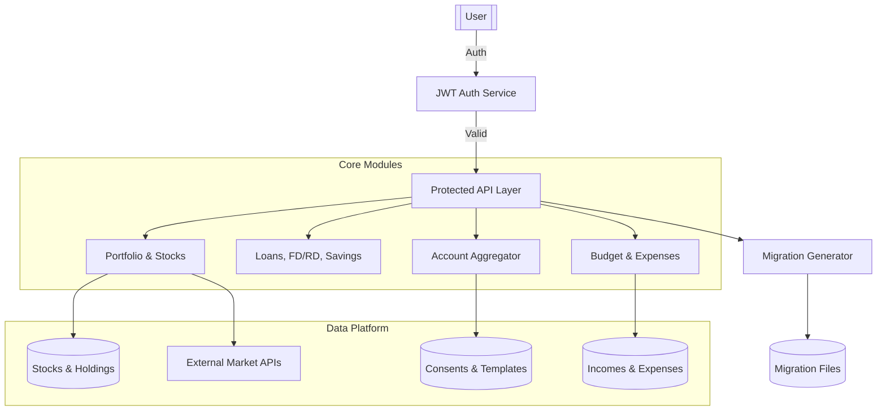

# 💰 PI SYSTEM — Personal Finance & Investment Intelligence

PI SYSTEM is a comprehensive Spring Boot-based financial intelligence platform designed to centralize and analyze your entire financial life. From tracking stock portfolios to managing loans and automating account aggregation, it provides a unified view for data-driven financial decisions.

> 📖 **Check out the [PRODUCT.md](./PRODUCT.md) for a detailed breakdown of Implemented vs. Planned features.**

---

## 🌟 Key Capabilities

- **📊 Portfolio Management**: Track stocks, ETFs, and mutual funds with real-time price updates.
- **📈 Performance Analytics**: Automated XIRR calculation and sector-based diversification scoring.
- **💸 Wealth Tracking**: Integrated management of Savings Accounts, FD/RD, Loans, and Insurance.
- **🏦 Account Aggregator (AA)**: Mock AA implementation for simulating bank data consent and fetching financial information.
- **📅 Budgeting & Expenses**: Track monthly limits, categorize expenses, and monitor income streams.
- **🛡️ Security**: JWT-based authentication with BCrypt encryption and role-based access.
- **🛠️ Developer Tools**: Built-in API to generate Flyway migration scripts with auto-formatting and versioning.
- **🔍 Audit & Logging**: System-wide request auditing and error logging for robustness.

---

## 🧭 System Architecture



---

## 🖥️ Frontend (React + Vite)

Located in the `/frontend` directory, the UI is built for a premium, high-performance experience.

- **Tech Stack**: React 18, Vite, Vanilla CSS, Recharts, Lucide Icons.
- **Rich Aesthetics**: Dark mode, glassmorphism, and smooth transitions.
- **Modules**: Portfolio Dashboard, Budget Tracker, AA Consent Manager, Net Worth Overview.

**Quick Start UI:**
```bash
cd frontend
npm install
npm run dev
```

---

## ⚙️ Backend (Spring Boot)

### Tech Stack
- **Source**: Java 17, Spring Boot 3
- **Database**: MySQL 8 (Flyway for migrations), Redis (Caching)
- **Security**: Spring Security + JWT
- **Documentation**: OpenAPI 3 / Swagger UI

### 🛠️ Developer Utility: Migration Generator
Created to reduce stress for developers, this API automatically creates Flyway migration files.
- **Endpoint**: `POST /api/v1/dev/migration/generate`
- **Features**: Auto-versioning, SQL keyword uppercasing, and `IF NOT EXISTS` safety checks.

### Running Locally
1. **Prerequisites**: Ensure MySQL and Redis are running.
2. **Configure**: Update `src/main/resources/application.yml`.
3. **Launch**:
   ```bash
   ./gradlew bootRun
   ```
4. **Docs**: Explore APIs at `http://localhost:8082/swagger-ui.html`

---

## 📁 Project Structure
- `src/main/java/com/aa`: Account Aggregator logic.
- `src/main/java/com/budget`: Budgeting and expense tracking.
- `src/main/java/com/portfolio`: Core investment and stock logic.
- `src/main/java/com/common/devtools`: Developer productivity tools.
- `src/main/resources/db/migration`: Flyway database versioning scripts.
