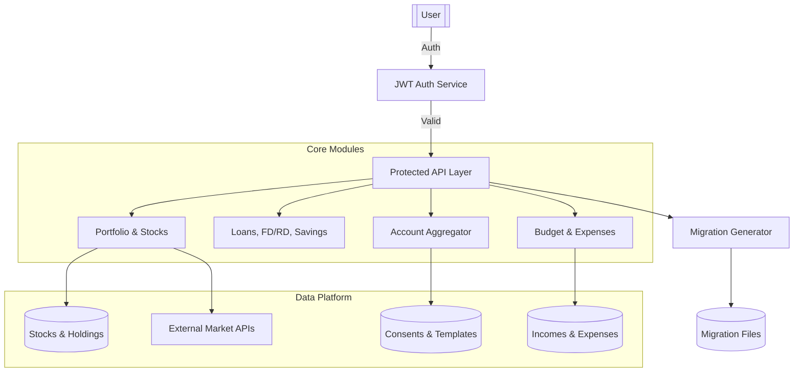

# 💰 PI SYSTEM — Personal Finance & Investment Intelligence

> **Last Updated**: February 6, 2026  
> **Status**: Active Development | Backend 95% Complete | Frontend 85% Complete

PI SYSTEM is a comprehensive Spring Boot-based financial intelligence platform designed to centralize and analyze your entire financial life. From tracking stock portfolios to managing loans and automating account aggregation, it provides a unified view for data-driven financial decisions.

## 📚 Documentation Navigation

### 🎯 **Quick Start by Module** (One file per module!)
- **📊 Portfolio & Stocks**: [docs/modules/PORTFOLIO_STOCKS_MODULE.md](docs/modules/PORTFOLIO_STOCKS_MODULE.md) - Complete portfolio management with real-time prices
- **💰 Loans**: [docs/modules/LOANS_MODULE.md](docs/modules/LOANS_MODULE.md) - EMI calculation, amortization, prepayment simulation
- **📄 Tax**: [docs/modules/TAX_MODULE.md](docs/modules/TAX_MODULE.md) - Regime comparison, capital gains, TDS management
- **🏦 All Other Modules**: [docs/modules/MODULE_QUICK_REFERENCE.md](docs/modules/MODULE_QUICK_REFERENCE.md) - Insurance, Lending, Budget, Advanced Features, Alerts, Admin

### 📖 **Additional Resources**
- 📊 **Product Overview**: [PRODUCT.md](./PRODUCT.md) - All features with implementation status
- 📈 **Development Progress**: [docs/PROGRESS.md](docs/PROGRESS.md) - Current status and milestones
- 🔍 **Feature Tracking**: [MODULE_PENDING_FEATURES.md](MODULE_PENDING_FEATURES.md) - Detailed module-wise status
- 🎓 **Complete Index**: [docs/DOCUMENTATION_INDEX.md](docs/DOCUMENTATION_INDEX.md) - All documentation files

---

## 🌟 Key Capabilities

### 💼 Investment & Portfolio (100% Complete)
- **📊 Real-Time Stock Tracking**: WebSocket-based live price updates every 30 seconds during market hours
- **📈 Portfolio Analytics**: XIRR calculation, P&L tracking, sector allocation, diversification scoring
- **💹 Transaction Management**: Buy/Sell/Dividend recording with FIFO method and complete history
- **📊 Multi-Asset Support**: Stocks, ETFs, Mutual Funds with unified portfolio view

### 💰 Wealth & Debt Management (100% Complete)
- **💰 Loans Module**: EMI calculator, amortization schedules, prepayment simulation, foreclosure analysis
- **💼 Lending Tracker**: Track money lent with repayment management and overdue alerts
- **🏦 FD/RD Management**: Fixed and recurring deposits tracking with maturity calculations
- **💳 Savings Accounts**: Multi-account balance tracking and interest monitoring

### 📄 Tax & Compliance (100% Complete)
- **📄 Smart Tax Planning**: Old vs New regime comparison with recommendations
- **💎 Capital Gains**: Auto-classification (STCG/LTCG) by asset type and holding period
- **🧾 TDS Management**: Quarterly tracking with reconciliation and Form 26AS integration
- **📊 Tax Projections**: Advance tax schedule calculator with slab-wise breakdown

### 🏥 Insurance & Protection (100% Complete)
- **🏥 Policy Management**: Life, Health, Motor, Home insurance tracking
- **💰 Premium Tracking**: Payment history with renewal reminders
- **🔔 Smart Alerts**: Policy expiry and premium due notifications
- **📋 Claims Management**: File and track insurance claims

### 📊 Budgeting & Planning (100% Complete)
- **📅 Budget Tracking**: Monthly budgets with category-wise allocation
- **💸 Expense Management**: Categorized expense tracking with budget vs actual
- **💰 Income Streams**: Multiple income source management
- **🔄 Subscriptions**: Track recurring subscriptions with cost analysis

### 🎯 Advanced Features (100% Complete - All 7 Features!)
- **🎯 Financial Goals**: Goal tracking with milestones and what-if scenarios
- **🔄 Recurring Transactions**: Automated transaction templates with scheduling
- **📊 Cash Flow Analysis**: Monthly cash flow projections and trend analysis
- **📁 Document Management**: Drag-and-drop upload with 8 categories
- **📈 Credit Score**: Score tracking with history and improvement tips
- **👴 Retirement Planning**: Corpus calculator with inflation-adjusted projections
- **⚖️ Portfolio Rebalancing**: Asset allocation drift analysis with rebalancing suggestions

### 🔔 Real-Time & Notifications (100% Complete)
- **⚡ WebSocket Integration**: Live stock prices and instant notifications
- **📧 Email Notifications**: EMI reminders, policy expiry, tax deadlines
- **🔔 Smart Alerts**: 9 alert types with customizable rules
- **📱 Multi-Channel**: In-app and email notification delivery

### 🔐 Security & Administration (100% Complete)
- **🛡️ JWT Authentication**: Secure login with token rotation and refresh
- **👥 Role-Based Access**: USER, ADMIN, SUPER_ADMIN with granular permissions
- **👑 Admin Portal**: User management, activity logs, system monitoring
- **🎛️ Feature Flags**: Dynamic feature toggles for gradual rollouts

### 🛠️ Developer Tools (100% Complete)
- **🔧 Migration Generator**: Auto-generate Flyway scripts with formatting
- **🧪 Testing Suite**: 138 integration tests with 65% coverage
- **📊 Monitoring**: Prometheus & Grafana integration ready
- **🔍 Audit Logging**: Complete request and activity tracking

---

## 🧭 System Architecture



---

## 🖥️ Frontend (React + Vite)

Located in the `/frontend` directory, the UI is built for a premium, high-performance experience.

- **Tech Stack**: React 18, Vite, Vanilla CSS, Recharts, Lucide Icons.
- **Rich Aesthetics**: Dark mode, glassmorphism, and smooth transitions.
- **Modules**: Portfolio Dashboard, Budget Tracker, Loans Manager, AA Consent Manager, Net Worth Overview.

**Quick Start UI:**
```bash
cd frontend
npm install
npm run dev
```

---

## ⚙️ Backend (Spring Boot)

### Tech Stack
- **Source**: Java 17, Spring Boot 3
- **Database**: MySQL 8 (Flyway for migrations), Redis (Caching)
- **Security**: Spring Security + JWT
- **Documentation**: OpenAPI 3 / Swagger UI

### 🛠️ Developer Utility: Migration Generator
Created to reduce stress for developers, this API automatically creates Flyway migration files.
- **Endpoint**: `POST /api/v1/dev/migration/generate`
- **Features**: Auto-versioning, SQL keyword uppercasing, and `IF NOT EXISTS` safety checks.

### Running Locally
1. **Prerequisites**: Ensure MySQL and Redis are running.
2. **Configure**: Update `src/main/resources/application.yml`.
3. **Launch**:
   ```bash
   ./gradlew bootRun
   ```
4. **Docs**: Explore APIs at `http://localhost:8082/swagger-ui.html`

---

## 📁 Project Structure
- `src/main/java/com/aa`: Account Aggregator logic.
- `src/main/java/com/budget`: Budgeting and expense tracking (52% complete - see [docs/BUDGET_MODULE.md](docs/BUDGET_MODULE.md)).
- `src/main/java/com/portfolio`: Core investment and stock logic.
- `src/main/java/com/common/devtools`: Developer productivity tools.
- `src/main/resources/db/migration`: Flyway database versioning scripts.

---

## 📚 Documentation

### 🎯 Quick Links
- **[Documentation Index](docs/DOCUMENTATION_INDEX.md)** - Central navigation hub ⭐
- **[Budget Module](docs/BUDGET_MODULE.md)** - Complete budget & expense documentation
- **[Development Standards](docs/DEVELOPMENT_STANDARDS.md)** - Coding guidelines & best practices
- **[Testing Process](docs/TESTING_PROCESS.md)** - Testing strategy & examples
- **[Deployment Guide](docs/DEPLOYMENT_GUIDE.md)** - Deployment procedures for all environments

### 📖 Core Documentation
- [Product Overview](PRODUCT.md) - Feature roadmap & status
- [Progress Tracker](docs/PROGRESS.md) - Development progress (52% overall)
- [Implementation Roadmap](IMPLEMENTATION_ROADMAP.md) - Sprint planning & backlog
- [Mobile Development](MOBILE_APP_DEVELOPMENT_GUIDE.md) - Mobile app guide
- [Features Documentation](docs/FEATURES.md) - Comprehensive features
- [Admin Portal](docs/ADMIN_PORTAL.md) - Admin features

### 🚀 Getting Started for New Developers
1. Read this README for project overview
2. Check [docs/DOCUMENTATION_INDEX.md](docs/DOCUMENTATION_INDEX.md) for complete navigation
3. Review [docs/DEVELOPMENT_STANDARDS.md](docs/DEVELOPMENT_STANDARDS.md) for coding standards
4. Follow [docs/TESTING_PROCESS.md](docs/TESTING_PROCESS.md) for testing guidelines
5. Explore [docs/BUDGET_MODULE.md](docs/BUDGET_MODULE.md) for budget features

---

## 📦 Archived Documentation

Older documentation has been archived in [docs/archive/](docs/archive/) for historical reference. All current documentation is accessible through [docs/DOCUMENTATION_INDEX.md](docs/DOCUMENTATION_INDEX.md).
