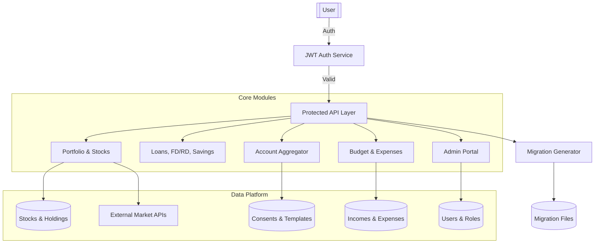

# 📚 PI System - Comprehensive Features Documentation

> **Last Updated**: ${new Date().toISOString().split('T')[0]}  
> **Version**: 1.0.0  
> **System**: Personal Investment & Financial Intelligence Platform

---

## 📖 Table of Contents

1. [System Overview](#system-overview)
2. [Architecture](#architecture)
3. [Authentication & Security](#authentication--security)
4. [Admin Portal](#admin-portal)
5. [Investment Management](#investment-management)
6. [Wealth Management](#wealth-management)
7. [Budgeting & Expenses](#budgeting--expenses)
8. [Account Aggregation](#account-aggregation)
9. [Developer Tools](#developer-tools)
10. [Testing Framework](#testing-framework)
11. [Deployment](#deployment)
12. [API Documentation](#api-documentation)

---

## 🎯 System Overview

### Vision
Build a trustworthy, read-only portfolio and risk analysis system that helps individual investors understand their financial exposure clearly without providing financial advice or execution capabilities.

### Core Principles
- **Increase user clarity**, not decision dependency
- **Focus on transparency** and explainability
- **Avoid advisory**, trading, or rebalancing actions
- **AI services** must remain strictly read-only ("Air Gap Enforcement")
- **All calculations** must be explainable and auditable

### Tech Stack
- **Backend**: Java 17, Spring Boot 3, Spring Security, JPA/Hibernate
- **Frontend**: React 18, Vite, Lucide React Icons
- **Database**: MySQL 8 with Flyway migrations
- **Caching**: Redis
- **Testing**: JUnit 5, REST Assured, Testcontainers
- **API Documentation**: OpenAPI 3 / Swagger UI

---

## 🏗️ Architecture



### Project Structure
```
src/main/java/com/
├── aa/              # Account Aggregator logic
├── auth/            # Authentication & JWT management
├── portfolio/       # Investment & stock management
├── budget/          # Budgeting & expense tracking
├── admin/           # Admin portal backend
├── common/          # Shared utilities & helpers
└── devtools/        # Developer productivity tools
```

---

## 🔐 Authentication & Security

### Features Implemented ✅

| Feature | Status | Description |
|---------|--------|-------------|
| JWT Authentication | ✅ | Secure login, registration, logout with token rotation |
| Password Security | ✅ | BCrypt encryption, forgot password flow |
| RBAC (Role-Based Access) | ✅ | Three roles: `ROLE_USER`, `ROLE_ADMIN`, `ROLE_SUPER_ADMIN` |
| Registration Guard | ✅ | Prevents client-side role escalation |
| Security Annotations | ✅ | Method-level security with `@PreAuthorize` |
| User Validation | ✅ | Email validation, duplicate prevention |
| AuthenticationHelper | ✅ | Centralized authentication utility for all controllers |

### API Endpoints
```
POST   /api/v1/auth/register        # User registration
POST   /api/v1/auth/login           # User login
POST   /api/v1/auth/logout          # User logout
POST   /api/v1/auth/refresh-token   # Refresh JWT token
POST   /api/v1/auth/forgot-password # Password reset
```

### Security Implementation Details
- **JWT Token Expiry**: 24 hours (configurable)
- **Refresh Token Rotation**: Yes
- **Password Encryption**: BCrypt with salt
- **CORS**: Configured for development and production
- **CSRF Protection**: Disabled for stateless APIs
- **XSS Protection**: Input validation and sanitization

---

## 👑 Admin Portal

### Overview
The admin portal provides privileged access to system administrators for managing users, monitoring system health, and configuring external services.

### Admin Roles
- **ROLE_ADMIN**: Standard administrator with full access to admin endpoints
- **ROLE_SUPER_ADMIN**: Super administrator with additional privileges
- **ROLE_USER_READ_ONLY**: Read-only user access

### Features Implemented ✅

#### User Management
| Feature | Status | Description |
|---------|--------|-------------|
| View All Users | ✅ | Paginated list with search and filter |
| User Search | ✅ | Search by name, email, mobile number |
| Role Filter | ✅ | Filter users by assigned roles |
| Pagination | ✅ | Efficient pagination (default 10 per page) |
| Create User | ✅ | Add new users from admin panel |
| Edit User | ✅ | Update user details (name, email, mobile) |
| Delete User | ✅ | Remove users from system |
| Role Management | ✅ | Add/remove roles for users |
| Role Assignment UI | ✅ | Modal interface for managing user roles |

#### Activity Tracking
| Feature | Status | Description |
|---------|--------|-------------|
| User Activity Logs | ✅ | Comprehensive audit trail |
| Login/Logout Tracking | ✅ | Captures authentication events |
| CRUD Operation Tracking | ✅ | Tracks all create/update/delete actions |
| IP Address Capture | ✅ | Records user IP (handles proxies) |
| User Agent Tracking | ✅ | Captures browser/device information |
| Status Tracking | ✅ | Success/failure status for all actions |
| Activity Logs Viewer | ✅ | Admin UI to view and filter logs |
| Details Modal | ✅ | Detailed view with IP, user agent, errors |

#### System Monitoring
| Feature | Status | Description |
|---------|--------|-------------|
| Critical Logs Viewer | ✅ | View system errors and warnings |
| External Services Config | ✅ | Manage external API configurations |
| Health Status Dashboard | ✅ | Overview of system health metrics |

### API Endpoints

#### User Management
```
GET    /api/v1/admin/users                    # Get all users (paginated, searchable)
GET    /api/v1/admin/users/{userId}           # Get user by ID
POST   /api/v1/admin/users                    # Create new user
PUT    /api/v1/admin/users/{userId}           # Update user
DELETE /api/v1/admin/users/{userId}           # Delete user
POST   /api/v1/admin/users/{userId}/roles/{roleName}   # Add role to user
DELETE /api/v1/admin/users/{userId}/roles/{roleName}   # Remove role from user
GET    /api/v1/admin/roles                    # Get all available roles
```

#### System Utilities
```
GET    /api/v1/admin/utilities/critical-logs  # Get critical system logs
GET    /api/v1/admin/utilities/activity-logs  # Get user activity logs
GET    /api/v1/admin/utilities/external-services  # Get external service config
PUT    /api/v1/admin/utilities/external-services  # Update service config
```

### Frontend Components

#### AdminDashboard.jsx
- Main landing page for administrators
- Cards for: Manage Users, Critical Logs, External Services, Activity Logs
- Navigation to all admin features

#### AdminUsers.jsx
- **Search Bar**: Real-time search by name, email, mobile
- **Role Filter**: Dropdown to filter users by role
- **Pagination**: Page controls with "Showing X to Y of Z users"
- **User Table**: Displays name, email, mobile, roles
- **3-Dots Menu**: Edit, Manage Roles, Delete options
- **Create User Button**: Opens modal to add new user
- **Role Management Modal**: 
  - View all user roles
  - Add new roles from dropdown
  - Remove existing roles
  - Visual feedback for actions

#### AdminActivityLogs.jsx
- **Activity Table**: Shows timestamp, user, action, description, status
- **Color-Coded Badges**:
  - LOGIN (green), LOGOUT (orange)
  - CREATE (blue), UPDATE (yellow)
  - DELETE (red), REGISTER (purple)
- **Status Indicators**: Success (green), Failure (red)
- **Details Modal**: Full activity information including:
  - User details (ID, name, email)
  - Action and resource information
  - IP address and user agent
  - Error messages (if any)
- **Back Navigation**: Return to admin dashboard

#### AdminCriticalLogs.jsx
- System error and warning viewer
- Filterable log entries
- Back navigation to dashboard

#### AdminExternalServices.jsx
- List of external service configurations
- Edit service properties
- Password field masking
- Back navigation to dashboard

### Database Schema

#### user_activity_logs Table
```sql
CREATE TABLE user_activity_logs (
    id BIGINT PRIMARY KEY AUTO_INCREMENT,
    user_id BIGINT NOT NULL,
    username VARCHAR(255),
    user_email VARCHAR(255),
    action VARCHAR(50) NOT NULL,
    resource_type VARCHAR(100),
    resource_id VARCHAR(255),
    description TEXT,
    ip_address VARCHAR(45),
    user_agent TEXT,
    timestamp TIMESTAMP DEFAULT CURRENT_TIMESTAMP,
    status VARCHAR(20),
    error_message TEXT,
    INDEX idx_user_id (user_id),
    INDEX idx_action (action),
    INDEX idx_timestamp (timestamp),
    INDEX idx_user_timestamp (user_id, timestamp)
);
```

### Security Implementation
- **AuthenticationHelper**: Centralized authentication utility
- **Admin Validation**: All endpoints verify admin role
- **Activity Logging**: Automatic logging via ActivityLogService
- **Input Validation**: All user inputs validated
- **Error Handling**: Graceful error responses

---

## 📊 Investment Management

### Portfolio Management
| Feature | Status | Description |
|---------|--------|-------------|
| Stock Data Retrieval | ✅ | Fetch stock details by symbol |
| Portfolio Holdings | ✅ | Add/track user stock holdings |
| Portfolio Summary | ✅ | Comprehensive analysis with returns |
| XIRR Calculation | ✅ | Annualized return computation |
| Sector Allocation | ✅ | Categorization by sectors |
| Diversification Scoring | ✅ | Portfolio concentration metrics |
| Price Caching | ✅ | Fallback to last known prices |
| Net Worth Calculator | ✅ | Aggregate wealth view |

### API Endpoints
```
POST   /api/v1/portfolio/stocks     # Add stock to portfolio
GET    /api/v1/portfolio/{userId}   # Get user portfolio
PUT    /api/v1/portfolio/{id}       # Update portfolio entry
DELETE /api/v1/portfolio/{id}       # Remove stock from portfolio
GET    /api/v1/portfolio/{userId}/summary  # Get portfolio summary
GET    /api/v1/stocks/{symbol}      # Get stock details
```

---

## 💰 Wealth Management

### Savings Accounts
- Create and manage savings accounts
- Track balances and interest rates
- Account history and transactions

### Fixed Deposits (FD)
- Create FD accounts with tenure and interest
- Maturity calculation
- Interest payout tracking

### Recurring Deposits (RD)
- Monthly recurring deposit tracking
- Maturity value calculation
- Payment schedule management

### Loans
- Track personal, home, and vehicle loans
- EMI calculation
- Payment history and outstanding balance

### Insurance
- Life and health insurance tracking
- Premium payment reminders
- Coverage summary

---

## 📅 Budgeting & Expenses

### Features
- Monthly budget limits
- Expense categorization
- Income stream tracking
- Budget vs. actual analysis
- Spending trends and analytics

### API Endpoints
```
POST   /api/v1/budget              # Create budget
GET    /api/v1/budget/{userId}     # Get user budgets
POST   /api/v1/expenses            # Record expense
GET    /api/v1/expenses/{userId}   # Get user expenses
GET    /api/v1/income/{userId}     # Get income sources
```

---

## 🏦 Account Aggregation (AA)

### Mock AA Implementation
- Simulate bank data consent flow
- Fetch financial information from consented accounts
- Template-based data retrieval
- Consent management and revocation

### API Endpoints
```
POST   /api/v1/aa/consent          # Create consent
GET    /api/v1/aa/consents/{userId}  # Get user consents
GET    /api/v1/aa/data/{consentId}   # Fetch aggregated data
DELETE /api/v1/aa/consent/{id}       # Revoke consent
```

---

## 🛠️ Developer Tools

### Migration Generator
Automatic Flyway migration file generator with:
- **Auto-versioning**: Increments version automatically
- **SQL Formatting**: Uppercase SQL keywords
- **Safety Checks**: `IF NOT EXISTS` clauses
- **Validation**: Syntax and naming validation

### API Endpoint
```
POST   /api/v1/dev/migration/generate
{
  "tableName": "users",
  "operation": "CREATE",
  "columns": [...]
}
```

### Features
- Generate CREATE TABLE migrations
- Generate ALTER TABLE migrations
- Auto-detect next version number
- SQL keyword uppercasing
- File naming with timestamp

---

## 🧪 Testing Framework

### Test Coverage
- **Unit Tests**: ~40% coverage
- **Integration Tests**: 37 tests across 4 controllers
- **Total Controllers**: 19 (21% covered)

### Implemented Tests ✅
1. **AuthControllerIntegrationTest** (10 tests)
   - User registration (success, duplicate, validation)
   - Login (success, invalid credentials)
   - Token refresh
   - Protected endpoint access

2. **SavingsAccountControllerIntegrationTest** (9 tests)
   - CRUD operations
   - Duplicate prevention (409 exception)
   - Not found handling (404 exception)
   - Validation errors

3. **FixedDepositControllerIntegrationTest** (11 tests)
   - CRUD operations
   - Maturity calculations
   - Validation (tenure, amount)
   - Exception handling

4. **PortfolioControllerIntegrationTest** (7 tests)
   - Add/update/delete portfolio entries
   - Portfolio value calculation
   - Symbol validation

### Test Framework Components
- **BaseApiTest**: Base class with REST Assured configuration
- **AuthHelper**: Authentication utilities for tests
- **TestDataBuilder**: Generate test data
- **ApiAssertions**: Common assertion methods
- **application-test.yml**: H2 in-memory database config

### Running Tests
```bash
# Run all tests
./gradlew test

# Run with coverage
./gradlew test jacocoTestReport

# Run specific test suite
./run-api-tests.sh auth
./run-api-tests.sh savings
./run-api-tests.sh portfolio
```

### Test Reports
- **HTML Report**: `build/reports/tests/test/index.html`
- **Coverage Report**: `build/reports/jacoco/test/html/index.html`

---

## 🚀 Deployment

### Docker Deployment
The system supports containerized deployment with Docker Compose.

#### Quick Start
```bash
# Build and start all services
docker-compose up -d

# View logs
docker-compose logs -f

# Stop services
docker-compose down
```

### Available Services
- **API**: http://localhost:8082
- **Swagger UI**: http://localhost:8082/swagger-ui.html
- **Health Check**: http://localhost:8082/actuator/health

### Configuration Profiles
- **Development**: `application-dev.yml`
- **Production**: `application-prod.yml`
- **Test**: `application-test.yml`

### Prerequisites
- Docker Engine 20.10 or higher
- Docker Compose 2.0 or higher
- At least 2GB RAM
- Ports 8082 (API) and 3306 (MySQL)

---

## 📚 API Documentation

### Swagger/OpenAPI
Interactive API documentation available at:
```
http://localhost:8082/swagger-ui.html
```

### API Versioning
All APIs are versioned with `/api/v1/` prefix.

### Authentication
All protected endpoints require JWT token in header:
```
Authorization: Bearer <jwt-token>
```

### Response Format
Standard response format:
```json
{
  "status": "success",
  "data": { ... },
  "message": "Operation completed successfully"
}
```

Error response format:
```json
{
  "status": "error",
  "error": "Error message",
  "timestamp": "2024-01-01T10:00:00Z"
}
```

---

## 🎨 Frontend Features

### Tech Stack
- React 18
- Vite build tool
- Lucide React Icons
- React Router for navigation
- Axios for API calls

### Key Features
- Dark mode with glassmorphism
- Smooth transitions and animations
- Responsive design
- Premium user experience

### Pages
1. **Dashboard**: Portfolio overview and net worth
2. **Portfolio**: Stock holdings and performance
3. **Budget Tracker**: Expenses and budget management
4. **Admin Portal**: User and system management
5. **AA Consent Manager**: Account aggregation consents

### Running Frontend
```bash
cd frontend
npm install
npm run dev
```

Frontend available at: http://localhost:5173

---

## 🔄 Feature Flags (Planned)

### Purpose
- Enable/disable features without redeployment
- Protect production during bugs
- Gradual feature rollout
- Emergency kill switch

### Levels
- **GLOBAL**: Affects entire application
- **MODULE**: Affects specific module
- **API**: Affects specific API
- **JOB**: Affects background jobs
- **USER**: Affects specific users/roles

---

## 📈 High-Impact APIs (Planned)

### Priority P0
1. **Financial Goals & Planning**
   - Set and track financial milestones
   - Intelligent projections
   - Milestone tracking

2. **Smart Alerts & Notifications**
   - Proactive monitoring
   - Critical financial event alerts
   - Customizable alert rules

### Priority P1
1. **Recurring Transactions & SIPs**
   - Automated recurring transactions
   - SIP management
   - Payment reminders

2. **Document Management**
   - Upload and organize financial documents
   - OCR for bill scanning
   - Document expiry tracking

3. **Subscription Tracker**
   - Track recurring subscriptions
   - Cost analysis
   - Cancellation reminders

### Priority P2
1. **Financial Health Score**
   - Comprehensive financial health metrics
   - Personalized recommendations
   - Improvement tracking

2. **Cash Flow Analysis**
   - Income vs. expense trends
   - Projection and forecasting
   - Liquidity analysis

---

## 📝 Notes

### Database Migrations
All database changes are managed through Flyway:
```
src/main/resources/db/migration/
├── V1__Initial_Schema.sql
├── V2__Add_User_Roles.sql
├── ...
└── V25__Create_User_Activity_Logs.sql
```

### Logging
- **Application Logs**: `logs/application.log`
- **Error Logs**: `logs/error.log`
- **Activity Logs**: Database table `user_activity_logs`

### Caching
Redis caching implemented for:
- Stock prices
- User sessions
- Portfolio summaries

---

## 🤝 Contributing

### Code Standards
- Follow Java coding conventions
- Write unit tests for new features
- Update API documentation
- Add Flyway migrations for schema changes

### Git Workflow
- Feature branches: `feature/description`
- Bug fixes: `fix/description`
- Hotfixes: `hotfix/description`

---

## 📞 Support

For issues or questions:
1. Check this documentation
2. Review API documentation (Swagger)
3. Check test examples
4. Contact development team

---

**Document Version**: 1.0.0  
**Last Updated**: 2024  
**Maintained By**: PI System Development Team
