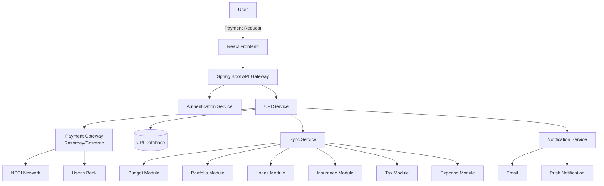

# 💳 UPI & Payments Integration Roadmap

> **Last Updated**: February 6, 2026  
> **Status**: Planned | Phase 1 Ready for Implementation  
> **Priority**: High - Critical for Complete Financial Ecosystem

---

## 📖 Table of Contents

1. [Overview](#overview)
2. [Why UPI Integration](#why-upi-integration)
3. [Phase 1: Core UPI Features](#phase-1-core-upi-features)
4. [Phase 2: Advanced Features](#phase-2-advanced-features)
5. [Phase 3: Financial Super App](#phase-3-financial-super-app)
6. [Integration with Existing Modules](#integration-with-existing-modules)
7. [Technical Architecture](#technical-architecture)
8. [Regulatory & Compliance](#regulatory--compliance)
9. [Security Requirements](#security-requirements)
10. [Implementation Timeline](#implementation-timeline)
11. [Competitive Advantage](#competitive-advantage)

---

## 🎯 Overview

Adding UPI/Payments functionality to PI System completes the financial ecosystem, enabling users to manage their entire financial life in one place. This transforms PI System from a tracking tool into a complete financial operating system.

**Current State**: Portfolio tracking, wealth management, budgeting, insurance, and tax planning.  
**Future State**: All of the above + daily transactions, bill payments, and payment orchestration.

**Vision**: Users should NEVER need to leave PI System for any financial task.

---

## ✅ Why UPI Integration

### Current PI System Strengths
- ✅ Portfolio tracking (stocks, MF, ETF)
- ✅ Wealth management (loans, FD/RD, savings)
- ✅ Budget & expense tracking
- ✅ Insurance management
- ✅ Tax planning
- ✅ Lending tracker
- ✅ Financial goals

### The Missing Piece
- ❌ **Daily transaction handling**
- ❌ Bill payments
- ❌ Money transfers
- ❌ Real-time payment tracking

### Value Proposition
By adding UPI, PI System becomes:
1. **Single source of truth** for all financial data
2. **Automated tracking** - expenses auto-categorized
3. **Intelligent insights** - AI understands complete money flow
4. **Action + Analysis** - not just tracking but doing

---

## 🚀 Phase 1: Core UPI Features

**Timeline**: 2-3 months  
**Status**: Ready to Start  
**Integration Partner**: Razorpay/Cashfree/PayU

### 1.1 Core Payment Features

| Feature | Priority | Complexity | Description |
|---------|----------|------------|-------------|
| **UPI ID Creation** | P0 | Medium | Create and link UPI ID (user@pisystem) |
| **Send Money (P2P)** | P0 | High | Person-to-person transfers |
| **Request Money** | P0 | Medium | Request payment from others |
| **QR Code Scanner** | P0 | Medium | Scan QR for payments |
| **Transaction History** | P0 | Low | View all UPI transactions |
| **UPI PIN Management** | P0 | High | Create, change, reset PIN |
| **Bank Account Linking** | P0 | High | Link one or multiple bank accounts |
| **Balance Check** | P1 | Medium | Check linked account balance |
| **Transaction Status** | P0 | Medium | Track payment status (pending/success/failed) |
| **Transaction Receipts** | P1 | Low | Generate payment receipts |

### 1.2 Backend API Endpoints

```java
// UPI Controller - Phase 1
@RestController
@RequestMapping("/api/v1/upi")
public class UpiController {
    
    // VPA Management
    POST   /create-vpa              // Create UPI ID
    GET    /vpa/{userId}            // Get user's UPI IDs
    DELETE /vpa/{vpaId}             // Remove UPI ID
    
    // Payments
    POST   /send-money              // Initiate payment
    POST   /request-money           // Request payment
    POST   /collect-request         // Respond to collect request
    POST   /verify-transaction      // Check transaction status
    
    // Bank Account Management
    POST   /link-bank-account       // Link bank account
    GET    /linked-accounts         // Get all linked accounts
    DELETE /unlink-account/{id}     // Unlink bank account
    GET    /balance/{accountId}     // Check account balance
    
    // Transaction Management
    GET    /transactions            // Get transaction history
    GET    /transactions/{id}       // Get specific transaction
    POST   /transactions/{id}/receipt // Generate receipt
    
    // QR Code
    POST   /generate-qr             // Generate payment QR
    POST   /scan-qr                 // Process scanned QR
}
```

### 1.3 Database Schema

```sql
-- UPI Virtual Payment Addresses
CREATE TABLE upi_vpa (
    id BIGINT PRIMARY KEY AUTO_INCREMENT,
    user_id BIGINT NOT NULL,
    vpa VARCHAR(100) UNIQUE NOT NULL,
    display_name VARCHAR(100),
    is_primary BOOLEAN DEFAULT FALSE,
    status ENUM('ACTIVE', 'BLOCKED', 'INACTIVE') DEFAULT 'ACTIVE',
    created_at TIMESTAMP DEFAULT CURRENT_TIMESTAMP,
    updated_at TIMESTAMP DEFAULT CURRENT_TIMESTAMP ON UPDATE CURRENT_TIMESTAMP,
    FOREIGN KEY (user_id) REFERENCES users(id)
);

-- Linked Bank Accounts
CREATE TABLE upi_bank_accounts (
    id BIGINT PRIMARY KEY AUTO_INCREMENT,
    user_id BIGINT NOT NULL,
    account_number VARCHAR(50) NOT NULL,
    ifsc_code VARCHAR(11) NOT NULL,
    bank_name VARCHAR(100) NOT NULL,
    account_holder_name VARCHAR(100) NOT NULL,
    is_primary BOOLEAN DEFAULT FALSE,
    status ENUM('ACTIVE', 'INACTIVE', 'BLOCKED') DEFAULT 'ACTIVE',
    created_at TIMESTAMP DEFAULT CURRENT_TIMESTAMP,
    updated_at TIMESTAMP DEFAULT CURRENT_TIMESTAMP ON UPDATE CURRENT_TIMESTAMP,
    FOREIGN KEY (user_id) REFERENCES users(id)
);

-- UPI Transactions
CREATE TABLE upi_transactions (
    id BIGINT PRIMARY KEY AUTO_INCREMENT,
    user_id BIGINT NOT NULL,
    transaction_id VARCHAR(100) UNIQUE NOT NULL,
    gateway_transaction_id VARCHAR(100),
    type ENUM('SEND', 'RECEIVE', 'REQUEST', 'REFUND') NOT NULL,
    amount DECIMAL(15, 2) NOT NULL,
    status ENUM('PENDING', 'SUCCESS', 'FAILED', 'EXPIRED') NOT NULL,
    from_vpa VARCHAR(100),
    to_vpa VARCHAR(100),
    bank_account_id BIGINT,
    merchant_name VARCHAR(255),
    description TEXT,
    category VARCHAR(50),
    receipt_url VARCHAR(500),
    error_code VARCHAR(50),
    error_message TEXT,
    initiated_at TIMESTAMP NOT NULL,
    completed_at TIMESTAMP,
    created_at TIMESTAMP DEFAULT CURRENT_TIMESTAMP,
    updated_at TIMESTAMP DEFAULT CURRENT_TIMESTAMP ON UPDATE CURRENT_TIMESTAMP,
    FOREIGN KEY (user_id) REFERENCES users(id),
    FOREIGN KEY (bank_account_id) REFERENCES upi_bank_accounts(id),
    INDEX idx_user_date (user_id, initiated_at),
    INDEX idx_status (status),
    INDEX idx_transaction_id (transaction_id)
);

-- UPI PIN (Encrypted)
CREATE TABLE upi_pin (
    id BIGINT PRIMARY KEY AUTO_INCREMENT,
    user_id BIGINT NOT NULL UNIQUE,
    pin_hash VARCHAR(255) NOT NULL,
    salt VARCHAR(255) NOT NULL,
    failed_attempts INT DEFAULT 0,
    locked_until TIMESTAMP NULL,
    last_changed_at TIMESTAMP DEFAULT CURRENT_TIMESTAMP,
    created_at TIMESTAMP DEFAULT CURRENT_TIMESTAMP,
    FOREIGN KEY (user_id) REFERENCES users(id)
);
```

### 1.4 Frontend Components

```
frontend/src/
├── pages/
│   └── upi/
│       ├── UpiDashboard.jsx        # Main UPI page
│       ├── SendMoney.jsx           # Send payment
│       ├── RequestMoney.jsx        # Request payment
│       ├── TransactionHistory.jsx  # Transaction list
│       └── QrScanner.jsx           # QR code scanner
├── components/
│   └── upi/
│       ├── UpiIdCard.jsx           # Display UPI ID
│       ├── BankAccountCard.jsx     # Bank account display
│       ├── TransactionCard.jsx     # Transaction item
│       ├── PinInput.jsx            # UPI PIN input
│       └── QrCodeGenerator.jsx     # Generate QR
└── services/
    └── upiService.js               # API calls
```

### 1.5 Integration with Existing Modules

**Auto-sync with Budget & Expense Module:**
```java
// After successful transaction
@Transactional
public void syncTransactionToExpense(UpiTransaction transaction) {
    if (transaction.getStatus() == TransactionStatus.SUCCESS) {
        Expense expense = new Expense();
        expense.setUserId(transaction.getUserId());
        expense.setAmount(transaction.getAmount());
        expense.setCategory(categorizeTransaction(transaction));
        expense.setDescription(transaction.getDescription());
        expense.setDate(transaction.getCompletedAt());
        expense.setSource("UPI");
        expenseService.createExpense(expense);
    }
}
```

---

## 🌟 Phase 2: Advanced Features

**Timeline**: 3-4 months after Phase 1  
**Status**: Planned

### 2.1 Bill Payments Integration

| Feature | Description | Integration |
|---------|-------------|-------------|
| **Electricity Bills** | Pay electricity bills | Link to existing Subscriptions module |
| **Gas Bills** | Pay gas bills | Auto-categorize in Budget |
| **Water Bills** | Pay water bills | Track in Expense module |
| **Mobile Recharge** | Prepaid & postpaid | Subscription tracking |
| **DTH Recharge** | DTH & cable bills | Recurring payment alerts |
| **Credit Card Payments** | Pay credit card bills | Link to Credit Score module |
| **Insurance Premiums** | Pay insurance premiums | **Sync with Insurance module** |
| **Loan EMI Payments** | Pay loan EMIs | **Sync with Loans module** |

### 2.2 Smart Categorization

```
AI-Powered Transaction Categorization:
- Groceries (Swiggy, Zomato, BigBasket)
- Transport (Uber, Ola, Rapido)
- Shopping (Amazon, Flipkart, Myntra)
- Utilities (Electricity, Gas, Water)
- Entertainment (Netflix, Prime, Hotstar)
- Healthcare (Pharmacy, Doctor visits)
- Education (Course fees, Books)
- Investments (SIP, Stocks - auto-link to Portfolio)
- Loan Payments (auto-link to Loans module)
- Insurance (auto-link to Insurance module)
```

### 2.3 Recurring Payments & Mandates

| Feature | Description |
|---------|-------------|
| **Standing Instructions** | Auto-pay for SIPs, EMIs, subscriptions |
| **UPI Autopay** | Set up recurring mandates |
| **Scheduled Transfers** | Schedule future payments |
| **Mandate Management** | Pause, modify, cancel mandates |
| **Subscription Tracking** | Link to existing Subscription module |

### 2.4 Enhanced QR Features

- Generate static QR for receiving payments
- Dynamic QR with amount pre-filled
- Business QR codes (if user has business)
- QR-based invoice payments

### 2.5 Split Bills & Group Payments

```
Split Bill Features:
- Create expense split with friends
- Track who owes whom
- Group settlements via UPI
- Integration with Lending module
- Expense sharing calculator
- Reminder notifications for pending splits
```

### 2.6 Backend Extensions

```java
// Bill Payment Service
@Service
public class BillPaymentService {
    
    // Pay Insurance Premium
    public void payInsurancePremium(Long policyId, PaymentRequest request) {
        // 1. Fetch policy from Insurance module
        // 2. Process UPI payment
        // 3. Update premium status in Insurance module
        // 4. Send payment receipt
    }
    
    // Pay Loan EMI
    public void payLoanEmi(Long loanId, PaymentRequest request) {
        // 1. Fetch loan from Loans module
        // 2. Process UPI payment
        // 3. Update EMI payment in Loans module
        // 4. Update amortization schedule
        // 5. Send payment receipt
    }
}
```

---

## 💎 Phase 3: Financial Super App

**Timeline**: 6-12 months after Phase 2  
**Status**: Vision

### 3.1 Investment via UPI

| Feature | Description |
|---------|-------------|
| **Buy Stocks via UPI** | Direct stock purchase through UPI mandate |
| **Mutual Fund SIP** | Start SIP with UPI Autopay |
| **IPO Applications** | Apply for IPOs via UPI |
| **FD/RD Booking** | Book fixed deposits via UPI |
| **Gold Purchase** | Buy digital gold |
| **NPS Contributions** | Contribute to NPS via UPI |

**Integration Flow:**
```
User Journey:
1. User selects stock in Portfolio module
2. Clicks "Buy Now"
3. Selects UPI payment
4. Enters quantity & price
5. Confirms with UPI PIN
6. Payment processed
7. Holding auto-added to Portfolio
8. Transaction synced to Expense module
```

### 3.2 Credit & Lending

| Feature | Description |
|---------|-------------|
| **Instant Loans** | Quick loans via UPI disbursement |
| **Pay Later** | BNPL (Buy Now Pay Later) integration |
| **Credit Lines** | Personal line of credit |
| **Peer-to-Peer Lending** | Lend to others via platform |
| **Loan Against Securities** | Quick loans against portfolio |

### 3.3 Merchant Solutions (Optional)

For users who run small businesses:
- Accept UPI payments
- Generate payment links
- Settlement reports
- Invoice generation & tracking
- GST-compliant receipts

### 3.4 Wealth Building Tools

| Feature | Description |
|---------|-------------|
| **Round-up Savings** | Invest spare change from transactions |
| **Auto-sweep** | Auto-transfer idle cash to investments |
| **Goal-based Auto-transfers** | Allocate money to goals automatically |
| **Smart Savings Rules** | Custom rules for automatic savings |

**Example Rule:**
```
Rule: "Save 10% of every income credit"
Trigger: UPI transaction received > ₹1000
Action: Transfer 10% to Investment Goal
Result: Automated wealth building
```

### 3.5 Family Banking

- Multi-user accounts (family members)
- Kids' wallet with parental controls
- Monthly allowances
- Spending limits & categories
- Expense approval workflows

### 3.6 Financial Marketplace

| Category | Features |
|----------|----------|
| **Insurance** | Compare policies, apply online, pay premiums |
| **Loans** | Compare loan offers, instant approval, disbursement |
| **Credit Cards** | Compare cards, apply online |
| **Investments** | Explore investment products |
| **FD/RD** | Compare bank rates, book instantly |

### 3.7 AI Financial Assistant

**Smart Spending Analysis:**
```
AI Insights:
- "You spent 30% more on dining this month"
- "Your grocery spending is trending up"
- "You have ₹5000 idle cash - invest in your Goal?"
- "Insurance premium due in 3 days - pay now?"
- "Your EMI is due tomorrow - auto-pay enabled"
```

**Proactive Recommendations:**
- Budget overspend alerts
- Investment opportunities based on cash flow
- Bill payment reminders
- Tax-saving suggestions
- Goal progress tracking

### 3.8 International Features

- Forex transfers via UPI
- International wallets
- Multi-currency support
- Cross-border payments
- Currency conversion

---

## 🔗 Integration with Existing Modules

### Complete User Journey Example

```
Scenario: Monthly Financial Flow

Day 1: Salary Credited
├─ UPI transaction detected (₹1,00,000)
├─ Auto-categorized as "Income"
├─ Synced to Budget module
└─ Triggers automated allocations

Day 3: Insurance Premium Auto-Paid
├─ UPI mandate executed (₹5,000)
├─ Insurance module updated ✅
├─ Expense tracked in Budget module
└─ Email receipt sent

Day 5: Loan EMI Auto-Paid
├─ UPI mandate executed (₹15,000)
├─ Loans module updated ✅
├─ Amortization schedule updated
└─ Remaining principal recalculated

Day 10: SIP Investment
├─ UPI Autopay executed (₹10,000)
├─ Portfolio module updated ✅
├─ New units added to MF holdings
└─ XIRR recalculated

Day 15: Grocery Shopping
├─ UPI payment via QR (₹3,500)
├─ Auto-categorized as "Groceries"
├─ Budget module updated
└─ Expense vs Budget tracked

Day 20: Friend Repays Loan
├─ UPI received (₹5,000)
├─ Lending module updated ✅
├─ Outstanding amount reduced
└─ Transaction marked complete

Day 25: Tax Payment
├─ UPI payment to Govt portal (₹20,000)
├─ Tax module updated ✅
├─ Advance tax recorded
└─ Remaining tax liability calculated

Month End: Complete View
├─ Net Worth updated
├─ Budget vs Actual report
├─ Investment returns calculated
├─ Cash flow analysis
└─ AI insights generated
```

### Module Integration Matrix

| UPI Feature | Integrates With | Auto-sync |
|-------------|-----------------|-----------|
| **Bill Payment** | Expense, Budget, Subscriptions | ✅ Yes |
| **Insurance Premium** | Insurance Module | ✅ Yes |
| **Loan EMI** | Loans Module | ✅ Yes |
| **SIP Payment** | Portfolio Module | ✅ Yes |
| **P2P Transfer** | Lending Module (optional) | ⚡ Optional |
| **Daily Expenses** | Budget & Expense Tracking | ✅ Yes |
| **Tax Payment** | Tax Module | ✅ Yes |
| **Savings** | FD/RD Module | ✅ Yes |

---

## 🏗️ Technical Architecture

### System Design



### Technology Stack

**Backend:**
```
- Spring Boot 3.x
- Spring Security for authentication
- JPA/Hibernate for database
- WebSockets for real-time updates
- Redis for caching transaction status
- Kafka for event streaming (transaction events)
```

**Payment Gateway Integration:**
```
Primary Options:
1. Razorpay (Recommended for starting)
2. Cashfree
3. PayU
4. PhonePe SDK
5. Direct NPCI (requires license)
```

**Frontend:**
```
- React 18
- WebSocket client for real-time updates
- QR code scanner library
- Biometric authentication (future)
```

### API Integration Example

```java
@Service
public class RazorpayUpiService {
    
    private final RazorpayClient razorpayClient;
    
    public UpiTransaction sendMoney(SendMoneyRequest request) {
        // 1. Validate UPI PIN
        validateUpiPin(request.getUserId(), request.getPin());
        
        // 2. Create Razorpay payment
        JSONObject paymentRequest = new JSONObject();
        paymentRequest.put("amount", request.getAmount() * 100); // Paise
        paymentRequest.put("currency", "INR");
        paymentRequest.put("method", "upi");
        paymentRequest.put("vpa", request.getToVpa());
        
        Payment payment = razorpayClient.payments.create(paymentRequest);
        
        // 3. Save transaction
        UpiTransaction transaction = new UpiTransaction();
        transaction.setUserId(request.getUserId());
        transaction.setAmount(request.getAmount());
        transaction.setToVpa(request.getToVpa());
        transaction.setGatewayTransactionId(payment.get("id"));
        transaction.setStatus(TransactionStatus.PENDING);
        
        transactionRepository.save(transaction);
        
        // 4. Publish event for async processing
        eventPublisher.publishEvent(new TransactionInitiatedEvent(transaction));
        
        return transaction;
    }
    
    @Async
    public void checkTransactionStatus(String transactionId) {
        // Poll Razorpay for status
        // Update transaction in database
        // Sync with other modules if successful
        // Send notification to user
    }
}
```

### Event-Driven Architecture

```java
// Transaction Event Handler
@Component
public class UpiTransactionEventHandler {
    
    @EventListener
    public void handleTransactionSuccess(TransactionSuccessEvent event) {
        UpiTransaction transaction = event.getTransaction();
        
        // 1. Sync with Expense module
        expenseService.createFromUpiTransaction(transaction);
        
        // 2. Sync with Budget module
        budgetService.updateBudgetUsage(transaction);
        
        // 3. Check if it's insurance premium
        if (isInsurancePremium(transaction)) {
            insuranceService.recordPremiumPayment(transaction);
        }
        
        // 4. Check if it's loan EMI
        if (isLoanEmi(transaction)) {
            loanService.recordEmiPayment(transaction);
        }
        
        // 5. Check if it's investment SIP
        if (isSipPayment(transaction)) {
            portfolioService.recordSipPayment(transaction);
        }
        
        // 6. Send notification
        notificationService.sendTransactionSuccessNotification(transaction);
    }
}
```

---

## ⚖️ Regulatory & Compliance

### Required Licenses & Approvals

| Requirement | Description | Timeline | Cost |
|-------------|-------------|----------|------|
| **Payment Aggregator License** | RBI approval to aggregate payments | 12-18 months | ₹25-50 lakhs |
| **PCI-DSS Certification** | For handling card data | 3-6 months | ₹5-10 lakhs |
| **ISO 27001** | Information security standard | 6-9 months | ₹3-5 lakhs |
| **KYC Compliance** | Aadhaar, PAN verification | Immediate | API costs |

### Compliance Requirements

**KYC (Know Your Customer):**
```
Mandatory Documents:
- Aadhaar Card (for eKYC)
- PAN Card (for tax purposes)
- Bank Account verification
- Mobile OTP verification
```

**Transaction Limits:**
```
Per Transaction Limit: ₹1,00,000
Daily Limit: ₹1,00,000 (can be increased with full KYC)
Monthly Limit: As per RBI guidelines

With Full KYC:
- Per Transaction: ₹2,00,000
- Daily: ₹2,00,000
```

**Data Privacy:**
- GDPR compliance for international users
- Data localization (store in India)
- User consent for data sharing
- Right to deletion

### Recommended Approach

**Start with Payment Aggregator Partnership:**
```
Phase 1A: Razorpay/Cashfree Integration
- Leverage their PA license
- Faster time to market
- Lower regulatory burden
- Pay transaction fees (1.5-2%)

Phase 1B (Parallel): Apply for PA License
- Start application process
- Takes 12-18 months
- Migrate once approved
- Reduce transaction costs
```

---

## 🔒 Security Requirements

### Critical Security Measures

**1. UPI PIN Security**
```java
// NEVER store PIN in plain text
// Use strong encryption with salt
public class UpiPinService {
    
    public void setUpiPin(Long userId, String pin) {
        // Generate random salt
        String salt = generateSalt();
        
        // Hash PIN with salt using bcrypt
        String pinHash = BCrypt.hashpw(pin, salt);
        
        // Store hash + salt (never the PIN itself)
        UpiPin upiPin = new UpiPin();
        upiPin.setUserId(userId);
        upiPin.setPinHash(pinHash);
        upiPin.setSalt(salt);
        
        upiPinRepository.save(upiPin);
    }
    
    public boolean validatePin(Long userId, String pin) {
        UpiPin storedPin = upiPinRepository.findByUserId(userId);
        
        // Check if account is locked
        if (storedPin.isLocked()) {
            throw new PinLockedException("Too many failed attempts");
        }
        
        // Verify PIN
        boolean isValid = BCrypt.checkpw(pin, storedPin.getPinHash());
        
        if (!isValid) {
            incrementFailedAttempts(userId);
        } else {
            resetFailedAttempts(userId);
        }
        
        return isValid;
    }
}
```

**2. Two-Factor Authentication**
```
Transaction Flow:
1. User initiates payment
2. Enter UPI PIN
3. OTP sent to registered mobile
4. Verify OTP
5. Process payment
```

**3. Fraud Detection**
```java
@Service
public class FraudDetectionService {
    
    public boolean detectFraud(UpiTransaction transaction) {
        // Check for suspicious patterns
        
        // 1. Unusual transaction amount
        if (transaction.getAmount() > getUserAverageTransaction(transaction.getUserId()) * 10) {
            return true;
        }
        
        // 2. Too many transactions in short time
        if (getTransactionCountLastHour(transaction.getUserId()) > 10) {
            return true;
        }
        
        // 3. New device login + large transaction
        if (isNewDevice() && transaction.getAmount() > 10000) {
            return true;
        }
        
        // 4. Transaction to frequently blocked VPAs
        if (isBlacklistedVpa(transaction.getToVpa())) {
            return true;
        }
        
        return false;
    }
}
```

**4. Encryption**
- End-to-end encryption for sensitive data
- TLS 1.3 for all API communications
- Encrypted database fields for UPI PIN
- Secure key management (AWS KMS / Vault)

**5. Transaction Limits**
```java
@Service
public class TransactionLimitService {
    
    public void validateLimit(UpiTransaction transaction) {
        Long userId = transaction.getUserId();
        BigDecimal amount = transaction.getAmount();
        
        // Per transaction limit
        if (amount.compareTo(PER_TRANSACTION_LIMIT) > 0) {
            throw new LimitExceededException("Per transaction limit exceeded");
        }
        
        // Daily limit
        BigDecimal todayTotal = getTodayTotalTransactions(userId);
        if (todayTotal.add(amount).compareTo(DAILY_LIMIT) > 0) {
            throw new LimitExceededException("Daily limit exceeded");
        }
        
        // Monthly limit
        BigDecimal monthTotal = getMonthTotalTransactions(userId);
        if (monthTotal.add(amount).compareTo(MONTHLY_LIMIT) > 0) {
            throw new LimitExceededException("Monthly limit exceeded");
        }
    }
}
```

**6. Audit Logging**
```java
// Log every transaction attempt
@Aspect
@Component
public class UpiAuditAspect {
    
    @Around("@annotation(AuditUpiTransaction)")
    public Object auditTransaction(ProceedingJoinPoint joinPoint) throws Throwable {
        AuditLog log = new AuditLog();
        log.setTimestamp(LocalDateTime.now());
        log.setAction(joinPoint.getSignature().getName());
        log.setUserId(getCurrentUserId());
        log.setIpAddress(getClientIp());
        
        try {
            Object result = joinPoint.proceed();
            log.setStatus("SUCCESS");
            return result;
        } catch (Exception e) {
            log.setStatus("FAILED");
            log.setErrorMessage(e.getMessage());
            throw e;
        } finally {
            auditLogRepository.save(log);
        }
    }
}
```

---

## 📅 Implementation Timeline

### Phase 1: Core UPI (Months 1-3)

**Month 1: Foundation**
- Week 1-2: Payment gateway integration (Razorpay/Cashfree)
- Week 3-4: Database schema & backend services
- Testing: Unit tests for core services

**Month 2: Features**
- Week 1-2: Send/receive money APIs
- Week 3-4: Transaction history, QR code
- Testing: Integration tests

**Month 3: Integration & Launch**
- Week 1-2: Frontend development
- Week 3: Integration with Budget/Expense modules
- Week 4: Beta testing & launch

**Deliverables:**
- ✅ UPI ID creation
- ✅ Send/receive money
- ✅ QR payments
- ✅ Transaction history
- ✅ Auto-sync with Budget module

---

### Phase 2: Advanced Features (Months 4-7)

**Month 4: Bill Payments**
- BBPS integration
- Utility bill payments
- Mobile/DTH recharge

**Month 5: Smart Features**
- AI categorization
- Insurance premium sync
- Loan EMI sync

**Month 6: Recurring Payments**
- UPI Autopay mandates
- Standing instructions
- Scheduled transfers

**Month 7: Polish & Enhancement**
- Split bills feature
- Group payments
- Enhanced QR features

**Deliverables:**
- ✅ 8+ bill payment categories
- ✅ AI-powered categorization
- ✅ Deep module integration
- ✅ Recurring payment setup

---

### Phase 3: Super App (Months 8-18)

**Months 8-10: Investment Integration**
- UPI-based stock purchase
- SIP via UPI Autopay
- IPO applications

**Months 11-13: Credit & Lending**
- Instant loans integration
- Pay Later features
- Credit line management

**Months 14-16: Wealth Tools**
- Round-up savings
- Auto-sweep to investments
- Goal-based transfers

**Months 17-18: Final Features**
- Family banking
- Financial marketplace
- AI assistant enhancements

---

## 🎯 Competitive Advantage

### Market Position

**Competitors Analysis:**

| App | Strengths | Weaknesses |
|-----|-----------|------------|
| **PhonePe** | ✅ UPI leader, bill payments | ❌ Weak investment tracking |
| **Paytm** | ✅ Ecosystem, payments | ❌ Complex UI, trust issues |
| **Google Pay** | ✅ Simple, popular | ❌ No financial intelligence |
| **ET Money** | ✅ Investment tracking | ❌ Basic payment features |
| **INDmoney** | ✅ Portfolio tracking | ❌ Limited payment integration |

**PI System Advantage:**

```
Unique Selling Proposition:

1. Complete Financial Intelligence
   - Not just payments, but full financial analysis
   - AI understands your ENTIRE money flow
   - One app = Complete financial life

2. Deep Integration
   - UPI payment auto-syncs to Budget
   - Insurance premium auto-updates policy
   - Loan EMI auto-updates amortization
   - SIP payment auto-updates portfolio
   
3. Privacy-Focused
   - Self-hosted option available
   - Data ownership with user
   - No selling of financial data
   
4. Holistic View
   ┌─────────────────────────────────┐
   │  Income (Salary via UPI)        │
   ├─────────────────────────────────┤
   │  ├─ Auto EMI Payment → Loans    │
   │  ├─ Auto Insurance → Insurance  │
   │  ├─ Auto SIP → Portfolio        │
   │  ├─ Expenses → Budget Tracking  │
   │  └─ Savings → FD/RD             │
   └─────────────────────────────────┘
   
   One transaction, multiple modules updated!

5. True Super App
   - Track investments: ✅
   - Make payments: ✅
   - Plan finances: ✅
   - Tax optimization: ✅
   - Insurance management: ✅
   - Loan tracking: ✅
   - Budget control: ✅
```

### Target Audience

**Primary:**
- Young professionals (25-40 years)
- High financial awareness
- Multiple investment accounts
- Looking for consolidation

**Secondary:**
- Small business owners
- Freelancers with irregular income
- Families managing multiple finances
- Retirees tracking pensions & investments

### Marketing Message

```
"Your Financial Operating System"

Stop juggling 10 apps for your finances.
PI System = One app for everything.

✅ Track your investments
✅ Pay your bills
✅ Manage your loans
✅ Plan your taxes
✅ Budget your expenses
✅ Achieve your goals

All in one place. All automated. All intelligent.
```

---

## 📝 Getting Started (For Developers)

### Prerequisites

1. **Payment Gateway Account**
   - Sign up for Razorpay/Cashfree
   - Get API keys (test & live)
   - Complete KYC

2. **Development Environment**
   - Java 17+
   - Spring Boot 3+
   - MySQL 8+
   - Redis
   - Node.js 18+

3. **Compliance**
   - Study RBI guidelines for PA
   - Understand UPI specifications
   - Review PCI-DSS requirements

### Configuration

```yaml
# application.yml
upi:
  gateway:
    provider: razorpay
    api-key: ${RAZORPAY_KEY}
    api-secret: ${RAZORPAY_SECRET}
    webhook-secret: ${RAZORPAY_WEBHOOK_SECRET}
  
  limits:
    per-transaction: 100000
    daily: 100000
    monthly: 1000000
  
  features:
    auto-sync-budget: true
    auto-sync-loans: true
    auto-sync-insurance: true
    ai-categorization: true
  
  security:
    pin-max-attempts: 3
    pin-lock-duration-minutes: 30
    require-otp: true
    require-2fa: true
```

### Next Steps

1. **Phase 1 Implementation**
   - Create UPI module structure
   - Integrate payment gateway
   - Build core APIs
   - Develop frontend

2. **Testing**
   - Test in sandbox mode
   - Simulate transactions
   - Test failure scenarios
   - Load testing

3. **Launch Strategy**
   - Beta launch to 100 users
   - Gather feedback
   - Fix bugs
   - Public launch

---

## 📚 References & Resources

### Documentation
- [RBI Payment Aggregator Guidelines](https://www.rbi.org.in/)
- [NPCI UPI Specifications](https://www.npci.org.in/)
- [Razorpay UPI API Docs](https://razorpay.com/docs/payments/upi/)
- [Cashfree UPI API Docs](https://docs.cashfree.com/)

### Compliance
- PCI-DSS Standards
- ISO 27001 Guidelines
- GDPR Compliance
- Data Localization Requirements

### Security
- OWASP Top 10 for APIs
- UPI PIN Best Practices
- Encryption Standards
- Fraud Prevention Techniques

---

## 🎉 Conclusion

Adding UPI to PI System transforms it from a powerful financial tracker into a complete **Financial Operating System**. Users will no longer need multiple apps - everything from daily transactions to long-term investments will be managed in one intelligent platform.

**Key Success Factors:**
1. Seamless integration with existing modules
2. Top-notch security and compliance
3. Intelligent automation and insights
4. User-friendly interface
5. Reliable payment processing

**Vision:** By 2027, PI System should be the go-to app for anyone serious about managing their complete financial life.

---

**Ready to Start?** 
Begin with Phase 1 - Core UPI features with Razorpay integration. Let's make PI System the only financial app anyone will ever need! 🚀
